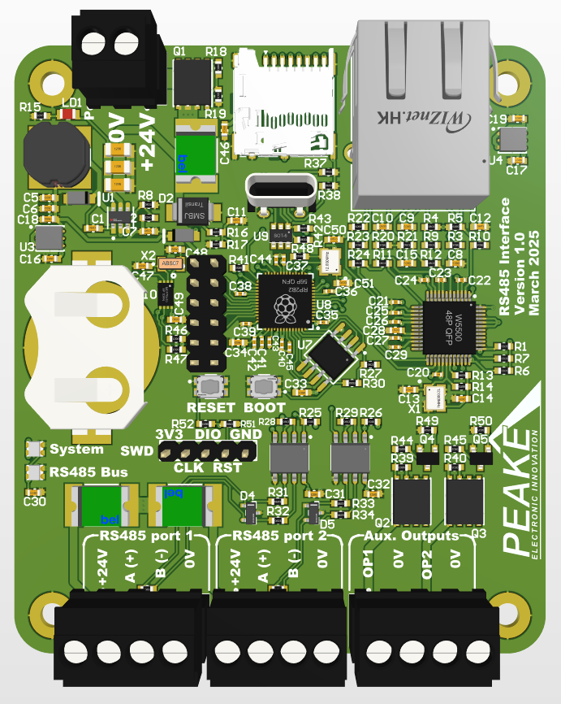

# Modbus IO Controller

The central hub of the Modbus IO System, built around the Raspberry Pi RP2040 microcontroller. This controller manages multiple IO boards via dual RS485 buses and provides a comprehensive web interface for system monitoring and configuration.



## Overview

The Modbus IO Controller serves as the master device in a distributed IO system, coordinating communication with up to 32 slave devices across two independent RS485 networks. It features a modern web interface, data logging capabilities, and robust networking features.

## Hardware Specifications

### Microcontroller
- **MCU**: Raspberry Pi RP2040
- **Architecture**: Dual-core ARM Cortex-M0+ @ 250MHz
- **Flash Memory**: 16MB (W25Q128)
- **RAM**: 264KB SRAM
- **Filesystem**: 1MB LittleFS partition

### Connectivity
- **Ethernet**: W5500 controller with RJ45 connector
- **RS485**: Dual isolated ports with automatic direction control
- **USB**: USB-C connector for programming and debugging
- **SD Card**: MicroSD slot for data logging

### Power System
- **Input**: 24VDC via terminal block
- **Regulation**: Switching regulator to 3.3V
- **Monitoring**: Voltage feedback with over/under voltage detection
- **Consumption**: ~2W typical operation

### Indicators
- **Status LEDs**: 2x WS2812B RGB LEDs for system and communication status
- **Power LED**: Green LED for power indication

## Key Features

### Web Interface
- **Dashboard**: Real-time temperature monitoring with interactive charts
- **Configuration**: Board management, channel setup, alarm configuration
- **Data Export**: CSV download of historical data
- **System Settings**: Network configuration, time sync
- **Responsive Design**: Works on desktop, tablet, and mobile devices

### Data Logging
- **Storage**: High-capacity SD card support (up to 32GB)
- **Format**: CSV files with timestamp, board ID, channel, temperature
- **Intervals**: Configurable per channel (1 second to 24 hours)
- **Management**: Automatic file rotation and storage monitoring

### Network Features
- **DHCP/Static IP**: Automatic or manual network configuration
- **NTP Sync**: Automatic time synchronization
- **mDNS**: Device discovery via hostname.local

### Modbus Management
- **Auto-Discovery**: Automatic detection of connected IO boards
- **Configuration**: Web-based setup of board parameters
- **Monitoring**: Real-time communication status and error detection
- **Addressing**: Automatic slave ID assignment and conflict resolution

## Software Architecture

### Dual-Core Design
- **Core 0**: Network management, web server, Modbus TCP
- **Core 1**: IO management, data logging, system monitoring

### Key Modules
- **Network Manager**: Ethernet, WiFi, and protocol handling
- **IO Core**: Board discovery, configuration, and data collection
- **Storage Manager**: SD card operations and data logging
- **Time Manager**: NTP synchronization and RTC management
- **Power Manager**: Voltage monitoring and power state management

## Pin Configuration

### RS485 Interfaces
- **Bus 1**: GPIO pins for UART1 with automatic DE/RE control
- **Bus 2**: GPIO pins for UART2 with automatic DE/RE control

### System Interfaces
- **I2C**: Real-time clock (MCP79410) communication
- **SPI**: Ethernet controller and SD card interfaces
- **Status LEDs**: WS2812B data line
- **Power Monitor**: ADC input for voltage feedback

## Development Setup

### Prerequisites
- PlatformIO IDE or CLI
- USB-C cable for programming
- 24V power supply for testing

### Build Process
```bash
# Clone repository
git clone <repository-url>
cd modbus-io-system/modbus-io-controller

# Build firmware
pio run

# Build filesystem image
pio run -t buildfs

# Upload firmware
pio run -t upload

# Upload filesystem
pio run -t uploadfs
```

### Web Asset Optimization
The build process includes automatic minification of web assets:
- **JavaScript**: Minified from 137KB to 18KB
- **HTML**: Compressed from 35KB to 13KB  
- **Charts**: Custom lightweight SVG implementation (14KB vs 207KB Chart.js)

## Configuration

### Network Setup
Access the web interface at the device IP address. Default configuration:
- **DHCP**: Enabled by default
- **Fallback IP**: 192.168.1.100
- **Hostname**: modbus-controller.local

### Board Management
1. Connect IO boards via RS485
2. Use "Scan for Boards" in web interface
3. Configure board settings and channel parameters
4. Enable data logging as needed

## Troubleshooting

### Common Issues
- **No web interface**: Check Ethernet connection and IP configuration
- **Board not detected**: Verify RS485 wiring and termination
- **Data logging fails**: Check SD card insertion and formatting
- **Time sync issues**: Verify NTP server accessibility

### LED Status Indicators
- **Status LED** (LED 1):
  - Green: System OK
  - Red: System error
  - Blue: Unconfigured
  - Orange: Warning
- **Communication LED** (LED 2):
  - Green: Active communication
  - Red: Communication error
  - Off: No activity

## Technical Notes

### Memory Optimization
The system implements advanced memory management techniques:
- **Binary Configuration Storage**: 90% reduction in RAM usage
- **Compressed Web Assets**: 88% reduction in flash usage
- **Efficient Data Structures**: Optimized for RP2040 constraints

### Performance
- **Scan Rate**: Up to 100Hz per channel depending on configuration
- **Web Response**: <100ms for most operations
- **Data Logging**: Sustained 1MB/hour with 32 channels @ 1Hz

## Hardware Revision

**Current Version**: v1.0 (March 2025)
- Initial production release
- Optimized power supply design
- Enhanced EMI protection

## Support

For technical support and documentation updates, contact Peake Electronic Innovation.
